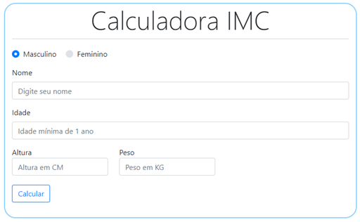

# CalculoImc
Calculadora de IMC (o peso ideal)

[Acesse aqui CalculoImc](https://paulovitorguedes-calculadora-imc.netlify.app/)
#### Projeto em *HTML*, *CSS*, *BOOTSTRAP* e *JAVASCRIPT*



A classificação do índice de massa corporal (IMC) pode ajudar a identificar problemas de obesidade ou desnutrição, em crianças, adolescentes, adultos e idosos.

Além de calcular o valor de IMC, esta calculadora também indica qual o intervalo de peso ideal que deve ter para garantir uma melhor qualidade de vida.

Ter um peso dentro do intervalo de peso ideal ajuda ainda a evitar o aparecimento de várias doenças crônicas, como diabetes e hipertensão.


___

### Como calcular o IMC
imc = peso / quadrado da altura 
```
peso = parseFloat(document.getElementById(peso).value);
altura = parseFloat(document.getElementById(altura).value / 100);
let imc = peso / (Math.pow(altura, 2));
```

___

### Tabela de resultados
Segundo o Ministério da Saúde, o resultado deve ser interpretado de acordo com a tabela abaixo.
[Referência vitat.com.br](https://vitat.com.br/calcular-o-imc/)

Indice IMC |  Caracteristica
:--- | :---
Menor que 16 | Magreza Grave 
16 a menor que 17 | Magreza Moderada
17 a menor que 18,5 | Magreza Leve
18,5 a menor que 25 | Saudável
25 a menor que 30 | Sobrepeso
30 a menor que 35 | Obesidade Grau I
35 a menor que 40 | Obesidade Grau II (considerada severa)
Maior que 40 | Obesidade Grau III (considerada mórbida)


